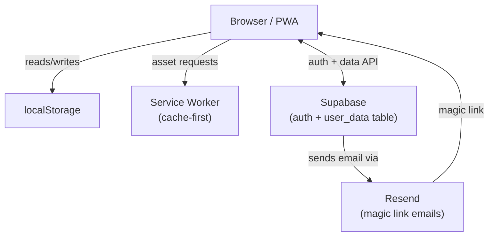
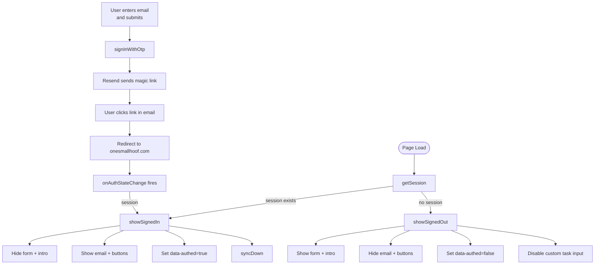
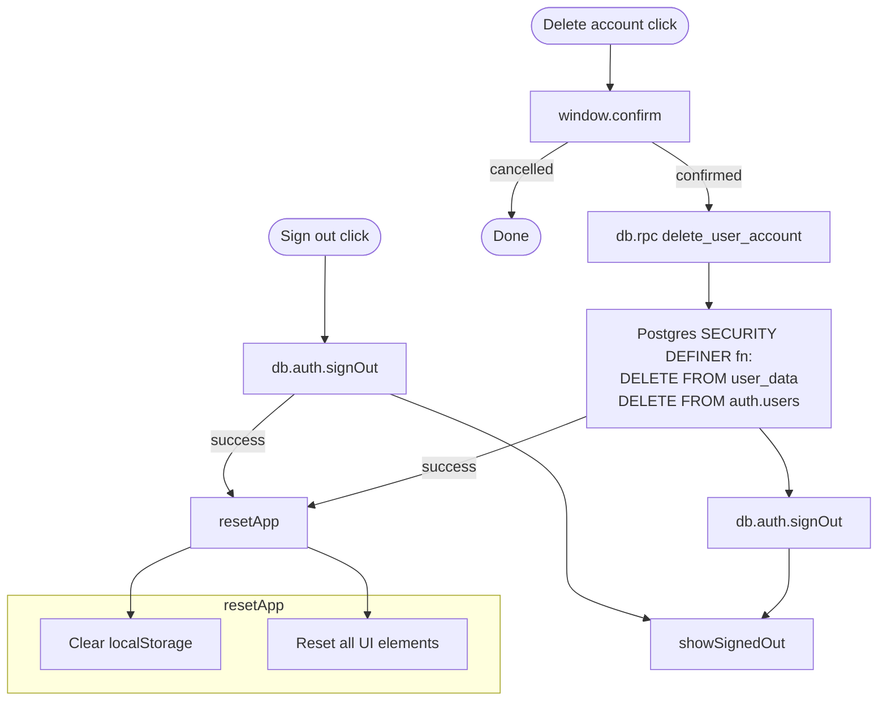
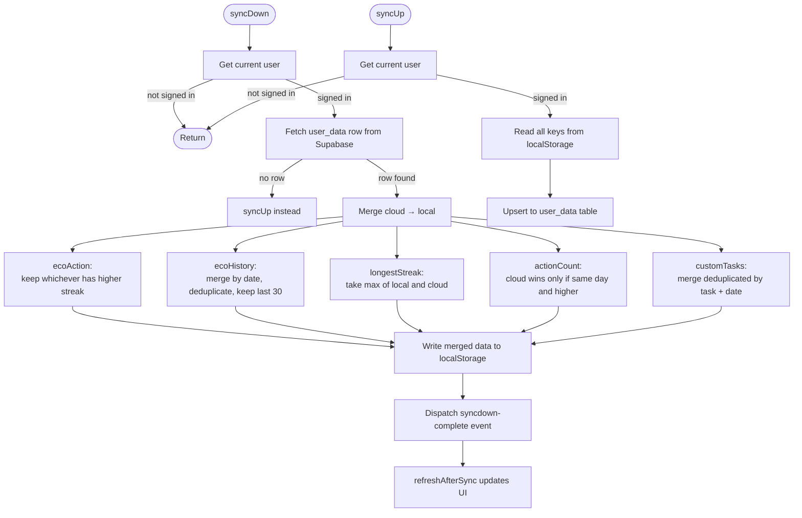
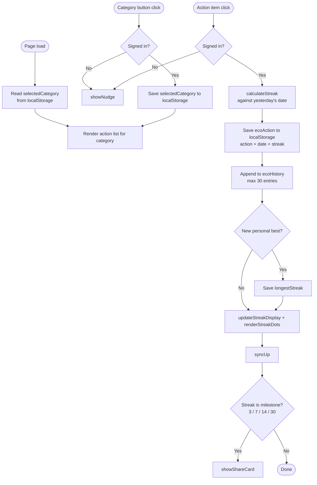
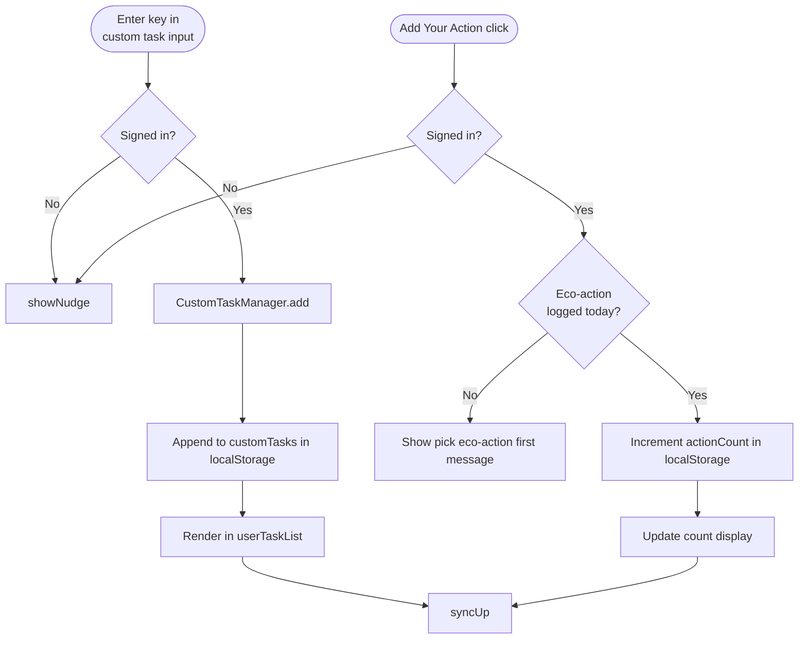
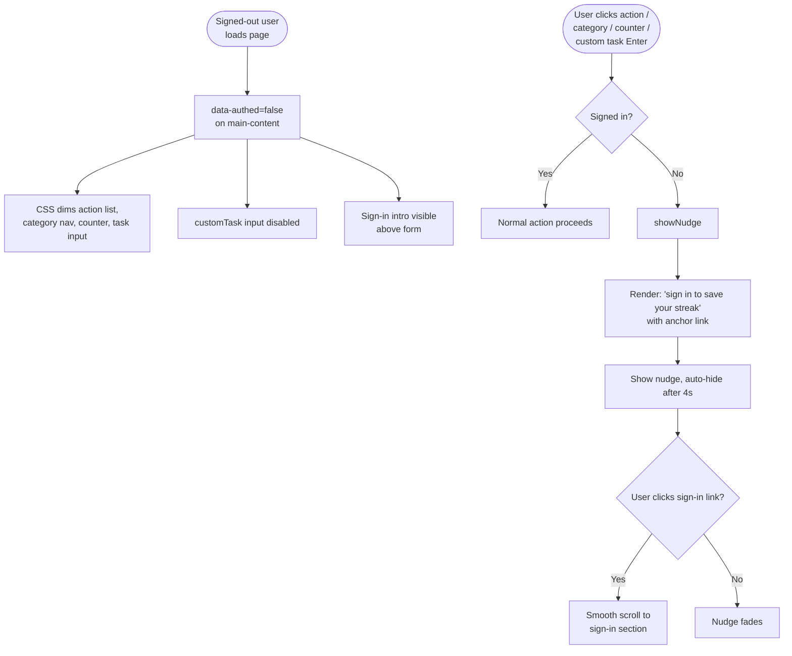
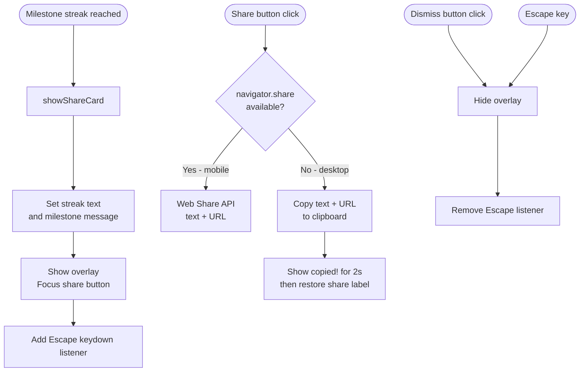
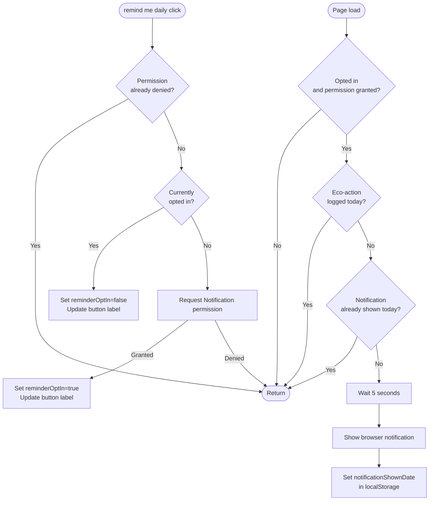

# One Small Hoof — Data Flow Diagrams

---

## 1. System Architecture

---

## 2. Auth & Session Flow

---

## 3. Sign-out & Account Deletion

---

## 4. Data Sync Flow

---

## 5. Eco Action Flow

---

## 6. Custom Tasks & Action Counter

---

## 7. Onboarding & Sign-in Nudge

---

## 8. Milestone Share Card

---

## 9. Daily Notification Flow

