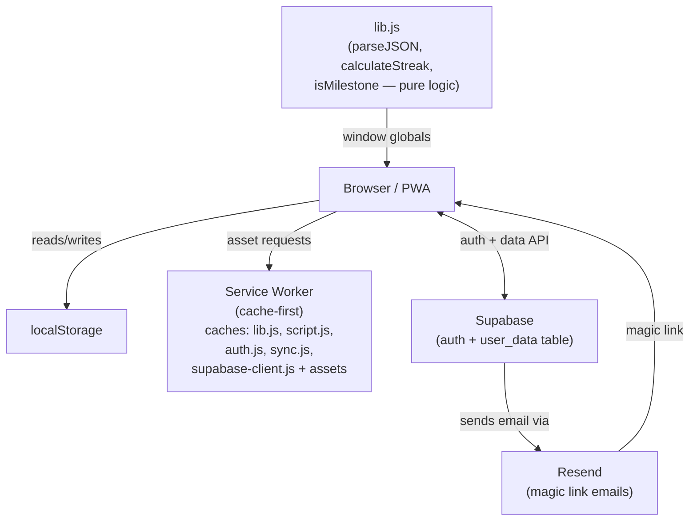
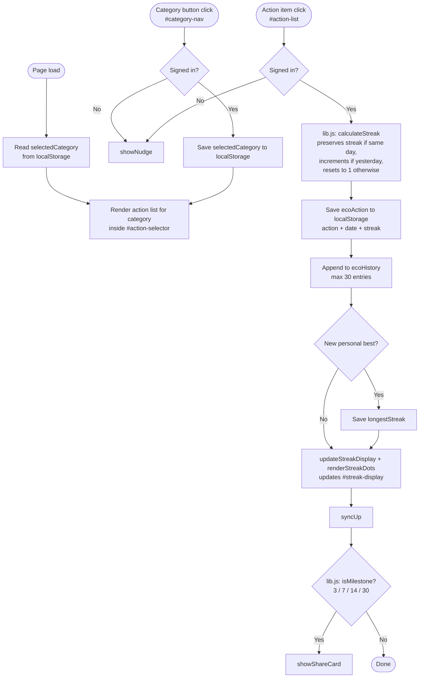
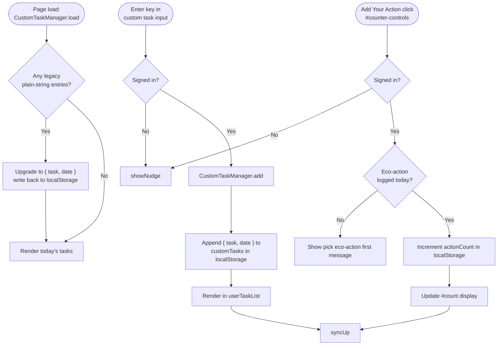
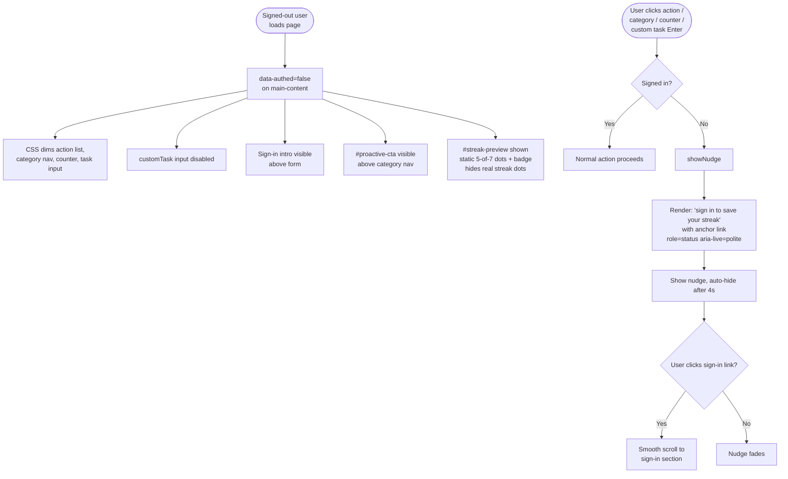
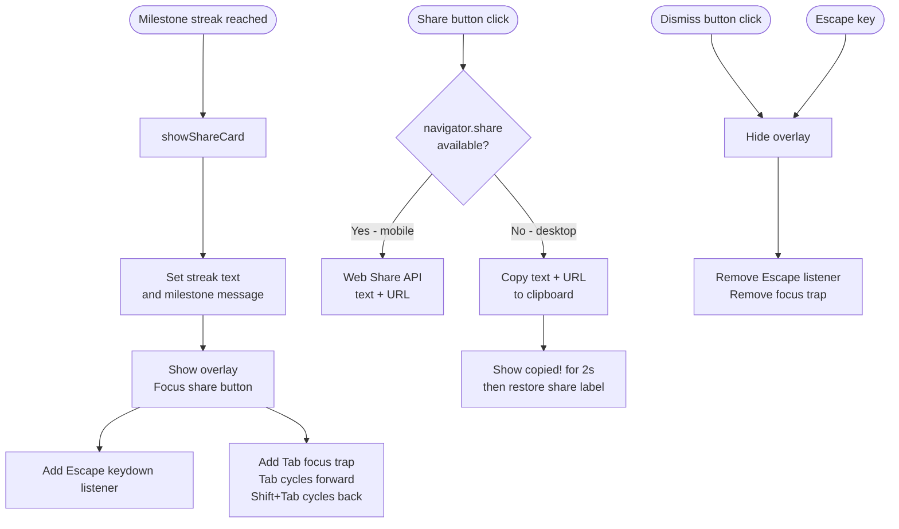

# One Small Hoof — Data Flow Diagrams

---

## 1. System Architecture



---

## 2. Auth & Session Flow

```mermaid
flowchart TD
    A([Page Load]) --> B[getSession]
    B -->|session exists| C[showSignedIn]
    B -->|no session| D[showSignedOut]

    E[User enters email\nand submits] --> F[signInWithOtp]
    F --> G[Resend sends magic link]
    G --> H[User clicks link in email]
    H --> I[Redirect to onesmallhoof.com]
    I --> J[onAuthStateChange fires]
    J -->|session| C
    J -->|event=SIGNED_IN| T[triggerToast\n"You're signed in. Start your streak!"]

    C --> C1[Hide form + intro]
    C --> C2[Show email + buttons]
    C --> C3[Set data-authed=true]
    C --> C4[syncDown]

    D --> D1[Show form + intro]
    D --> D2[Hide email + buttons]
    D --> D3[Set data-authed=false]
    D --> D4[Disable custom task input]
```

---

## 3. Sign-out & Account Deletion


---

## 4. Data Sync Flow


---

## 5. Eco Action Flow



---

## 6. Custom Tasks & Action Counter



---

## 7. Onboarding & Sign-in Nudge



---

## 8. Milestone Share Card



---

## 9. Daily Notification Flow


